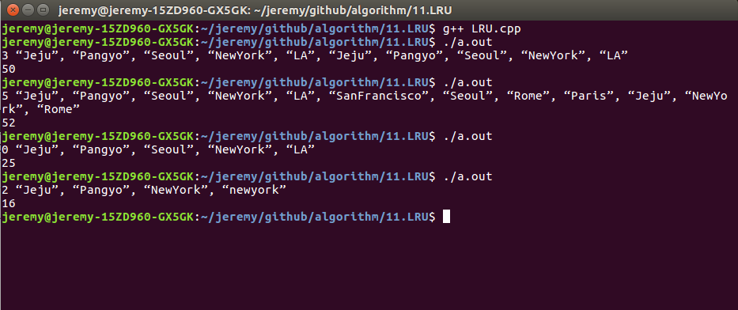

운영체제를 공부했다면 누구나 한번쯤 들어봤을 것이다. 또한 정보처리기사에도 자주 출제되고 중요한 교체기법중 하나이다. 2017 하반기 카카오 코딩문제에도 출제될 만큼 중요한 것 같다. 운영체제를 공부하면서 이런 알고리즘을 이론적으로만 공부하면서 해결했지 직접 코딩을 해본적이없어서 시험에 마주쳤을 때 당황했다. 입력으로는 캐시 크기와 도시이름을 받고 출력으로는 걸리는 시간을 구하는 것 이다. cache hit일 경우 실행 1, cache miss일 경우 실행 5로 계산한다.

* cache hit : 요구되는 데이터가 이미 캐시에 로딩 되어 있는 경우이다.

* cache miss : 캐시에 존재 하지않을 경우 이다.

# LRU (Least Rescently Used) 란?

* LRU는 Least Rescently Used의 약자로 우리말로는 최근 최소 사용이다. 즉, 가장 오래 된 걸 교체한다.

* 운영체제의 페이지 교체 알고리즘 중 하나 이다.

* 최근에 다른 어떤 페이지보다 적게 사용된 페이지를 골라 교체하는 알고리즘이다.

* 일반적으로 가장 오랫동안 액세스 되지 않았던 페이지는 조만간에도 엑세스 되지 않을 확률이 크다는 시간적 집약성에 기반한다.

## Example

|7|0|1|2|0|3|0|4|2|3|0|3|
|-|-|-|-|-|-|-|-|-|-|-|-|
|7|7|7|2|2|2|2|4|4|4|0|0|
| |0|0|0|0|0|0|0|0|3|3|3|
| | |1|1|1|3|3|3|2|2|2|2|
|F|F|F|F| |F| |F|F|F|F| ||

* 5번쨰 열 F가 없는 걸 보자.

* 그 전에 가장 오래된걸 구하면 0>1>2 순이였다.(숫자는 위치가 아닌 메모리안에 있는 값이다.)

* 0 이 들어왔는데 안에 있으므로 1>2>0 순으로 오래 되었다.

* 그 다음에 3이 들어왔으므로 2>0>3 순으로 되었다.(1을 지우고 3으로 교체 후 가장 최근 사용이므로 순위를 뒤로 했다.)

* 7 번째 열 F가 없는 걸 보자.

* 그 전에 가장 오래된걸 구하면 2>0>3 순이였다.

* 0이 들어왔는데 안에 있으므로 2>3>0 순이 되었다.

* 그 다음에 4가 들어왔으므로 3>0>4 순이 되었다.

## Code

[깃허브 링크](https://github.com/rim0621/Algorithm-study/tree/master/11.LRU/LRU.cpp)

## 결과

#### [더보기](http://rim0621.tistory.com/)
