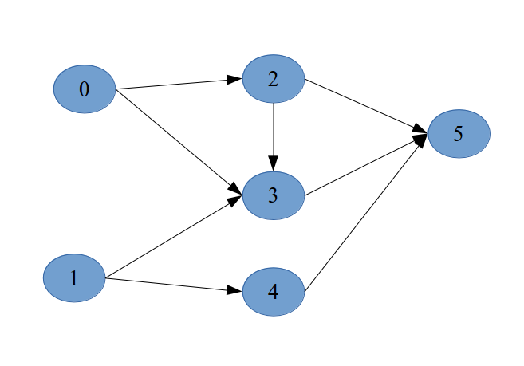

# 위상정렬 (topological sorting)
* 방향 그래프에 존재하는 각 정점들의 선행 순서를 위해하지 않으면서 모든 정점을 나열하는 것.
* **진입 차수 0인 정점**(들어오지않는)을 선택하고 선택된 정점과 여기에 부속된 모든 간선을 삭제한다.
* 반복해서 모든 정점이 선택,삭제되면 알고리즘을 종료.
* 이 과정에서 선택되는 정점의 순서를 **위상순서**(topological order)라 한다.
#### example

1. 진입 차수가 없는 0,1 선택가능. 후보: 0,1 (여기선 1 선택)	(스택사용)
2. 1에서 뻗는 간선들 삭제.(그러면 4에 들어오는 차수 0) 후보: 0,4 (4 선택)
3. 4에서 뻗는 간선(4->5)삭제. (5는 들어오는 다른 간선이 있기 때문에 후보X) 후보: 0 (0 선택)
4. 반복...
5. 위상 순서: 1 4 0 2 3 5

#### Code
```
for i=0 to n-1
   if(모든 정점이 선행 정점을 가지면)
	사이클이 존재하여 위상 정렬 불가;
   선행 정점을 가지지 않은 정점 v 선택;
   v출력;
   v와 v연결된 간선들 삭제

```

```C++
//스택을 사용한다.

#include<stdio.h>
#include<stdlib.h>
#include<iostream>
#include<vector>
#define TRUE 1
#define FALSE 0
#define MAX_V 50
using namespace std;
typedef struct GraphNode{
    int vertex;
    struct GraphNode *link;
}GraphNode;

typedef struct GraphType{
    int n;	//정점의 개수
    GraphNode *adj_list[MAX_V];
}GraphType;

//그래프 초기화
void graph_init(GraphType *g)
{
    g->n=0;
    for(int v=0;v<MAX_V;v++)
	g->adj_list[v]=NULL;
}
//삽입
void insert_vertex(GraphType *g, int v)
{
    if( ((g->n)+1) > MAX_V){
	fprintf(stderr,"그래프: 정점의 개수 초과");
	return ;
    }
    g->n++;
}
void insert_edge(GraphType *g, int u,int v)
{
    GraphNode *node;
    // 개수 > 벌택스 번호들 (u,v)
    if( u>=g->n || v>=g->n){
      fprintf(stderr,"그래프: 정점 번호 오류");
      return ;
    }

    node= (GraphNode *)malloc(sizeof(GraphNode));
    node->vertex = v;
    node->link=g->adj_list[u];
    g->adj_list[u]=node;
}


//위상 정렬
void topo_sort(GraphType *g)
{
    vector<int> s;	//instead of stack
    GraphNode *node;
    //모든 정점의 진입차수 계산 in_degree[i] 가 0 일경우 후보가된다. in_degree가 0 인 노드가지워지면 그 노드가 연결한 다른 노드의 in_degree를 줄인다.
    int *in_degree=(int *)malloc(g->n* sizeof(int));

    for(int i=0;i<g->n;i++)
	in_degree[i]=0;	//초기화

    for(int i=0;i<g->n;i++){
	GraphNode *node = g->adj_list[i];
	while(node!=NULL)
	{
	    in_degree[node->vertex]++;
	    node = node->link;
	}
    }
  //	진입차수가 0인 정점을 스택에 삽입
    for(int i=0;i<g->n;i++)
    {
	if(in_degree[i]==0) s.push_back(i);
    }
    //위상 순서 생성
    while(!s.empty()){
	int w;
	w=s.back();
	s.pop_back();
	printf("%d",w);
	node=g->adj_list[w];		//각 정점의 진입차수를 변경
	while(node !=NULL){
	    int u=node-> vertex;
	    in_degree[u]--;
	    if(in_degree[u]==0) s.push_back(u);	//진입차수 0이면 후보로
	    node=node->link;	//다음 정점
	}

    }

    free(in_degree);

}

int main()
{
    GraphType g;
    graph_init(&g);
    insert_vertex(&g,0);
    insert_vertex(&g,1);
    insert_vertex(&g,2);
    insert_vertex(&g,3);
    insert_vertex(&g,4);
    insert_vertex(&g,5);

    insert_edge(&g,0,2);
    insert_edge(&g,0,3);
    insert_edge(&g,1,3);
    insert_edge(&g,1,4);
    insert_edge(&g,2,3);
    insert_edge(&g,2,5);
    insert_edge(&g,3,5);
    insert_edge(&g,4,5);

    topo_sort(&g);
    printf("\n");
     return 0;
}


```

#### 사용예
- 게임 전직.
- 선수 과목 수강시 수강
- 등등  

